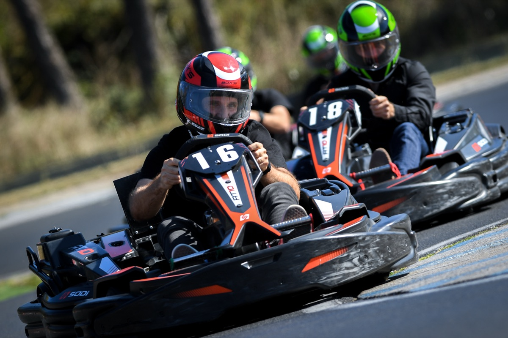

<div align="center">


<a href="https://readme-typing-svg.demolab.com">
  
</a>

<br/>

<a href="https://taggaddaaaa.github.io/LP_EasySN/"></a>


<a href="https://tidycal.com/easysn"></a>

</div>

<br/>

> **Landing page du produit EasySN.** Une page, un message : tes publications LinkedIn, Facebook et Instagram préparées chaque jour à partir de **tes vraies photos**, validées en 1 clic par email. Pas de génération d'image IA. C'est le différenciateur, et c'est tout le pitch.

<br/>

## ✨ Ce que la page raconte

| | |
|---|---|
| 📷 | **Tes vraies photos, jamais d'IA.** On part de ta banque d'images (Google Drive). Ta marque reste la tienne. |
| ✍️ | **Des légendes à ta voix.** Notre programme lit ta base de connaissance et rédige, adapté à chaque réseau. |
| ✅ | **Tu valides en 1 clic, par email.** Chaque matin : Publier, Suivant ou Annuler. Rien ne part sans toi. |
| 🔗 | **3 réseaux d'un coup.** LinkedIn, Facebook et Instagram publiés ensemble. |

<br/>

## 🎬 Aperçu

<div align="center">
  <a href="https://taggaddaaaa.github.io/LP_EasySN/">
    
  </a>
  <br/>
  <sub>Le genre de <b>vraies photos</b> dont on part. Ici notre premier client, <b>LOC'KARTING</b> (circuit de karting près de Montpellier).</sub>
  <br/><br/>
  <a href="https://taggaddaaaa.github.io/LP_EasySN/"><b>👉 Ouvrir la page en ligne</b></a>
</div>

<br/>

## 🎨 Design system

Tons chaleureux, énergie orange, police **Outfit**. Tokens complets dans [`design.md`](design.md).

<div align="center">


</div>

<br/>

## 🛠️ Stack

- **HTML / CSS / JS vanilla**, un seul fichier [`index.html`](index.html). Aucun build, aucune dépendance.
- Police **Outfit** via Google Fonts.
- Hébergé sur **GitHub Pages** (branche `main`).
- CTA branchés sur **TidyCal** (`https://tidycal.com/easysn`) : une seule constante à éditer dans `index.html`.

## 🚀 Lancer en local

```bash
git clone https://github.com/taggaddaaaa/LP_EasySN.git
cd LP_EasySN
python3 -m http.server 8080
# puis ouvre http://localhost:8080
```

## 📁 Structure

```
LP_EasySN/
├── index.html     ← toute la landing page (styles + contenu + scripts)
├── design.md      ← design system (couleurs, typo, tokens)
├── assets/        ← visuels (hero-lockarting.jpg, à remplacer par la banque Drive client)
└── README.md      ← ce fichier
```

## 💸 Coût d'exploitation

Aucun coût. GitHub Pages, Google Fonts et la prise de RDV TidyCal (offre gratuite) sont gratuits. Services locaux ou gratuits uniquement.

<div align="center">
<br/>
<sub>Fait avec ❤️ pour les TPE et PME françaises · <a href="https://github.com/taggaddaaaa/LP_EasySN">taggaddaaaa/LP_EasySN</a></sub>


</div>
